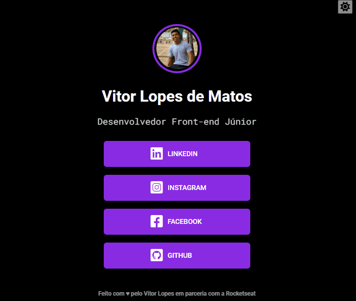

# PROJETO REDES SOCIAIS 💻

Projeto criado na segunda edição do evento Explore da Rocketseat, 
que foi uma semana de imersão tecnológica para iniciantes, que 
tratava de assuntos referentes ao desenvolvimento frontend. Neste
projeto, apliquei algumas modifição adicionando um código JavaScript
para mudança do tema de fundo do projeto, ficou top!🤌

### Imagem do Projeto 👌

### Links

- URL do Site ao vivo: [https://vitorlopes523.github.io/redes-sociais/]
- URL do código no GitHub: [https://github.com/vitorlopes523/redes-sociais]

## Meu processo

### Construído com

- Marcação semântica HTML5
- Propriedades personalizadas CSS
- Flexbox
- Linguagem de programação JavaScript

### Desenvolvimento contínuo

- Aprimorar ainda mais conhecimento em HTML e sua semântica.
- Aprimorar sobre as propriedades de CSS, principalmente flexbox e grid.
- Aprender a base do JavaScript.
- Ter conecimento do JavaScript avançado.
- Aprender e aperfeiçoar o framework React.
- Desenvolver técnicas que melhore meu status como profissional.

Espero que tenha gostado!🙂